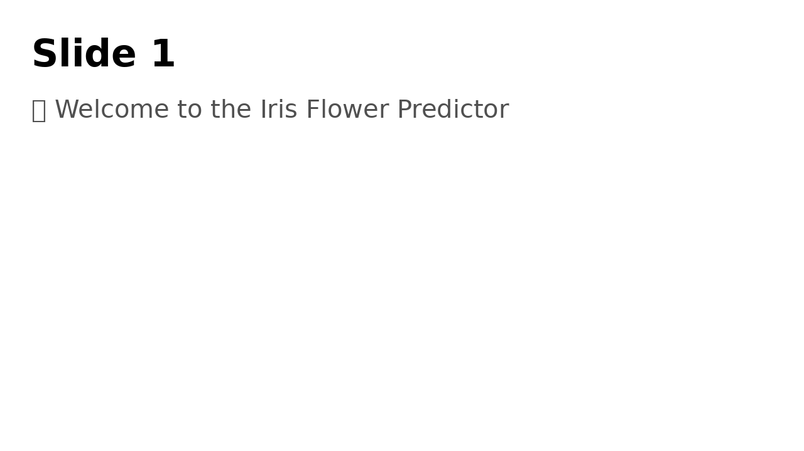
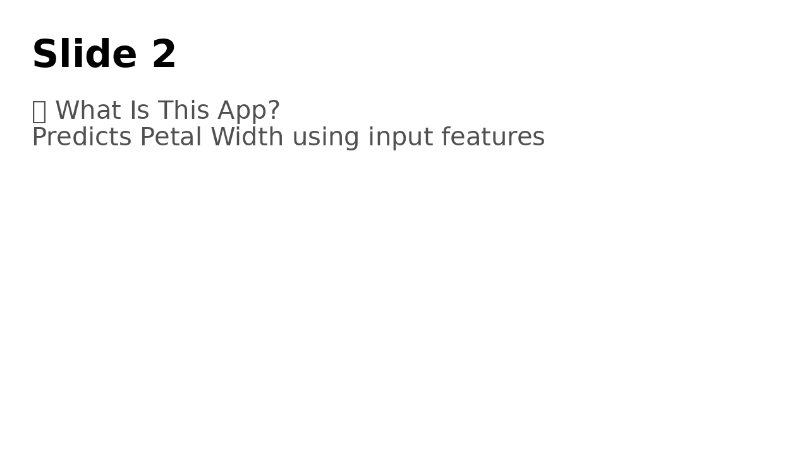
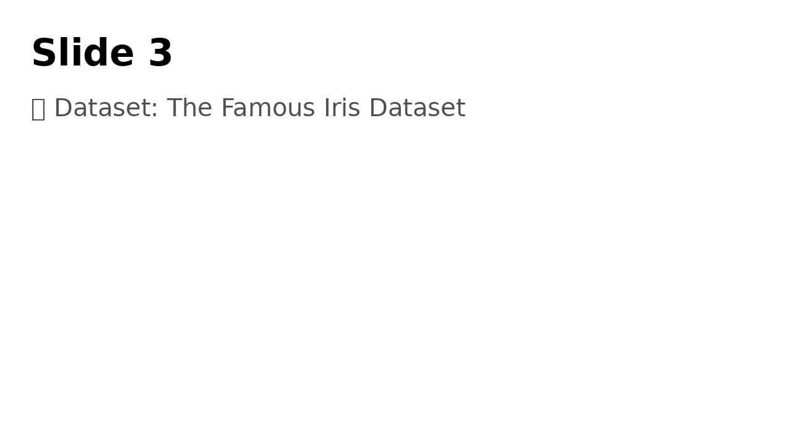

# 🌸 Iris Flower Petal Width Predictor

This R Shiny app predicts the **Petal Width** of iris flowers based on user input for **Sepal Length**, **Sepal Width**, **Petal Length**, and **Species**.

## 🔍 Features

- Built with R Shiny for interactive predictions
- Uses Linear Regression with real-time output
- Dynamic UI and graphs (R², residuals, predictions)
- Dataset: classic **Iris** dataset (3 species, 150 samples)
- Deployed at: [shinyapps.io](https://khemanta.shinyapps.io/flower-predictor/)

## 📷 Screenshots

### Home Slide

### Dataset Slide

### Model Diagnostic

## 📦 Files

- `pitch.Rmd` – Source R Markdown for ioslides presentation
- `www/` – Folder with required images (`iris1.jpg`, `iris2.jpg`, `iris3.jpg`)
- `server.R` & `ui.R` – App logic and interface
- `custom.css` – Optional styling

## 📬 Contact

Built by **Hemant K.** – khemanta@outlook.com

## Johns Hopkins University -- Data Science Specialization in R

The working directory for the shiny app looks like below tree: 

RWork/ddp/
├── app/
│   ├── ui.R
│   ├── server.R
│   └── www/
│       └── iris.jpg
├── pitch/
│   ├── pitch.Rmd
│   ├── pitch.html   <-- auto-generated after knitting
│   └── .nojekyll    <-- for GitHub Pages to work if needed
└── README.md
