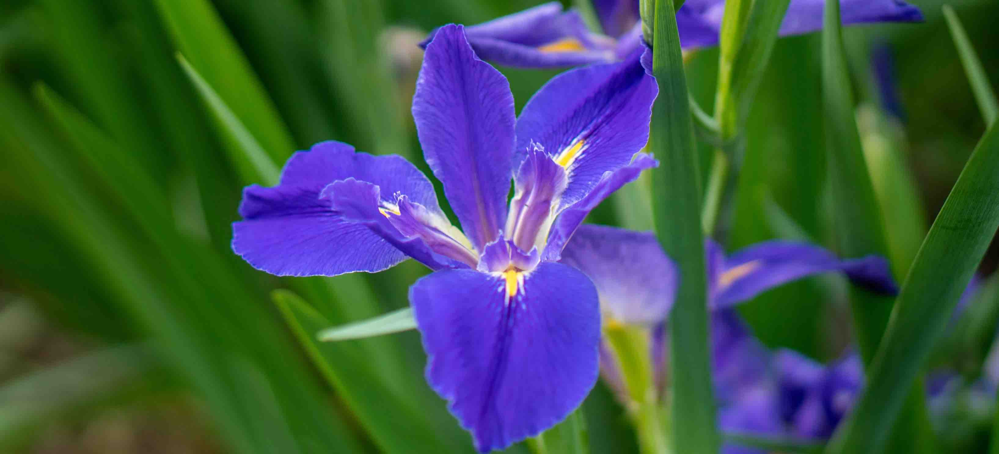

## 🌸 Welcome to the Iris Flower Predictor




### Predict the Petal Width of Iris Flowers Based on Input Features  
Built using R Shiny, linear models, and interactive UI

---

## 📊 What Is This App?

- Predicts **Petal Width** using features like Sepal Width, Sepal Length, Petal Length, and Species  
- Built with **Shiny** for interactivity  
- Shows **dynamic predictions**, model info, and **visual output**  
- Lightweight, browser-based — No installation needed  
- **Demo** hosted at: [shinyapps.io link](https://khemanta.shinyapps.io/flower-predictor/)

---

## 🖼️ Dataset: The Famous Iris Dataset

- Contains 150 measurements of 3 iris flower species: *setosa*, *versicolor*, and *virginica*  
- Variables used:
  - Sepal.Width, Sepal.Length
  - Petal.Length, Species
  - Petal.Width (predicted)


---

## ⚙️ How the App Works

- You select input features from a sidebar  
- Click **Predict** ➡ App returns the predicted petal width  
- You see:
  - A graph of prediction  
  - R² value, error bars  
  - Species-wise output  
- All in real-time (thanks to reactive programming in R)

---

## 💻 Under the Hood: The Model

```{r echo=TRUE, message=FALSE}
model <- lm(Petal.Width ~ Sepal.Width + Sepal.Length + Petal.Length + Species, data = iris)
summary(model)


## 📈 Model Diagnostics

```{r, echo=FALSE, message=FALSE, warning=FALSE}
library(ggplot2)
library(broom)

model_diag <- augment(model)
ggplot(model_diag, aes(.fitted, .resid)) +
  geom_point(color = "darkblue") +
  geom_hline(yintercept = 0, linetype="dashed", color="red") +
  labs(title = "Residuals vs Fitted Values", x = "Fitted Petal Width", y = "Residuals") +
  theme_minimal()
```

---

## 🌟 Why This App?

- Simple, intuitive prediction interface  
- Combines multiple iris features and species info  
- Visual feedback with interactive plots  
- Educates users on regression and shiny apps  
- Fully reproducible and extendable  

---

## 🔗 Source & Demo

- Source code on [GitHub](https://github.com/khemanta/Rwork/tree/master/ddp/)  
- Live demo at [shinyapps.io](https://khemanta.shinyapps.io/flower-predictor/)  
- Contact: Hemant K. (khemanta@outlook.com)

--- 


  